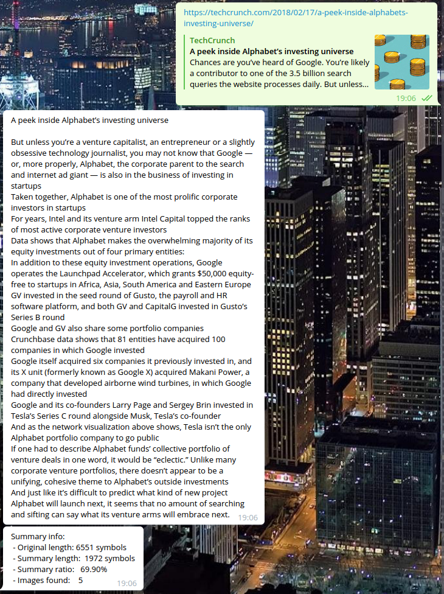

# telegram-bot

App provides the possibility of getting summary of the article by URL. Just give valid URL for the bot, he will read it for you with pleasure and give some response.

For now it works only with articles in English.

Bot is not deployed, for now if you whant use it, just complete simple steps:

1. Put your [ngrok](https://ngrok.com/download) file into root folder
2. Create bot with telegram BotFather and get you api key
3. set env variable TELEGRAM_TOKEN="your_api_key_here"

Use it with:

```Bash
$ make init && make build
$ ./telegram_bot
```

example output:
